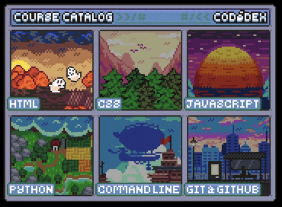

<div align="center">



# Rayue20-cloud


---

```bash
$ whoami

> Linux & Infrastructure Enthusiast
> Networking Specialist
> Automation Focused
> Backend / Systems
> Argentina 🇦🇷
```

</div>

---

# ⚡ SYSTEM STATUS

<p align="center">
  
</p>

---

# 📈 ACTIVITY


---

# 🛠 TECH STACK

<div align="center">


</div>

---

# 🚀 CURRENT OBJECTIVES

```yaml
focus:
  - Linux Systems
  - Networking
  - Infrastructure
  - Automation
  - Remote Technical Operations

status: ONLINE
learning: ACTIVE
```

---

# ☢ LIVE TERMINAL

```bash
> initializing system...

[ OK ] Linux Kernel
[ OK ] Network Interfaces
[ OK ] SSH Services
[ OK ] Infrastructure Stack
[ OK ] Automation Scripts

SYSTEM STATUS: OPERATIONAL
```

---

# 🧠 ABOUT ME

```txt
I enjoy working with systems, infrastructure,
networking and backend technologies.

Interested in:
- Remote environments
- Critical infrastructure
- Linux ecosystems
- Automation
- Technical operations
```

---

# 🔥 CONTRIBUTIONS

<div align="center">


</div>

---

# 🐍 CONTRIBUTION SNAKE

<div align="center">


</div>

---

# 📡 CONNECT

<div align="center">

<a href="https://github.com/Rayue20-cloud">

</a>

</div>

---

<div align="center">


</div>
